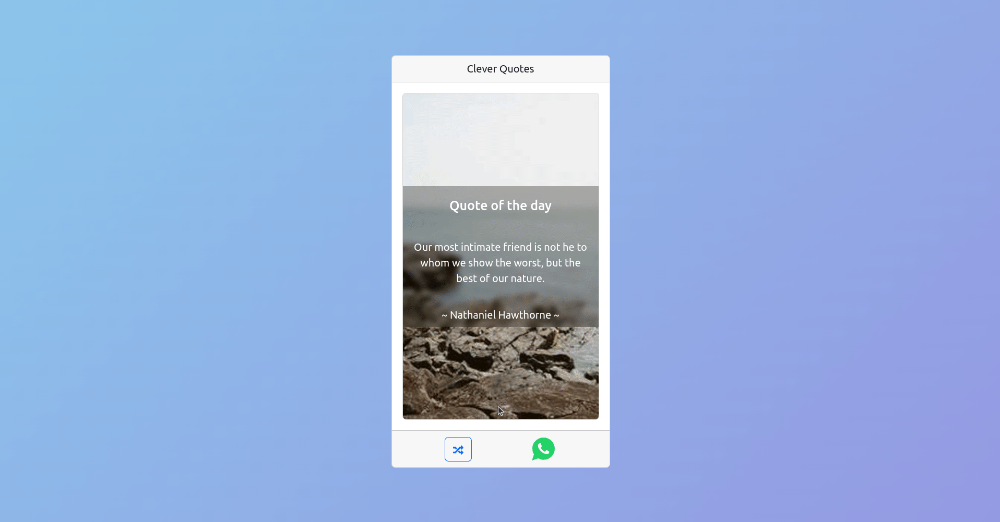

# :relieved: Clever Quotes App

Description is available in the following translations / Die Beschreibung liegt in den folgenden Übersetzungen vor:

[English (Englisch)](#english)<br>

[German (Deutsch)](#german)<br>



## :star_struck: Working Application Link:

[Clever Quotes App](https://clever-quotes-app.netlify.app/) hosted on [Netlify](https://www.netlify.com/)

#

## <a name ="german">German Description / Deutsche Beschreibung</a>

#

## :hugs: Einleitung:

Dies ist ein Anfänger freundlich Spaß ReactJs Projekt.

Es ist die klassische Random Quote Generator App, die auf Luke Peaveys Random Quotes API basiert.

Da ich es liebe, Zitate über meinen WhatsApp-Status zu teilen, habe ich die WhatsApp-Share-Funktionalität dank des React Share NPM-Pakets zur App hinzugefügt.

Das WhatsApp-Symbol stammt von React Icons.

Alle Links sind unten aufgeführt.

<hr>

### :bulb: Für maximale Vergnügen, INSTALLIEREN und verwenden Sie diese App auf einem Smartphone!

#

## :cowboy_hat_face: Verwendetes API:

- [Random Quotes API](https://github.com/lukePeavey/quotable) für die zufälligen Zitate

- [Lorem Picsum](https://picsum.photos/) für die zufälligen Bilder.

```

https://api.quotable.io/random

```

#

## :package: Verwendete Pakete:

1.  Die ReactJS-Anwendung wurde mit [Vite.](https://vitejs.dev/) initialisiert.

```javascript

npm create vite@latest

```

2. [React-Share](https://www.npmjs.com/package/react-share?activeTab=readme) wurde für die WhatApp Sharing-Funktionalität verwendet

```javascript

npm i react-share

```

3. [React Icons](https://react-icons.github.io/react-icons/) wurde für den WhatsApp-Knopf verwendet

```javascript

npm install react-icons --save

```

4. [React Bootstrap](https://react-bootstrap.github.io/) wurde für das Styling, die Karten- und Knopfkomponenten verwendet

```javascript

npm install react-bootstrap bootstrap

```

5. Danke an [CSS-Gradients](https://cssgradient.io/gradient-backgrounds/) für den tollen UI-Hintergrund-Farbverlauf:

Ich habe diesen Code von ihnen übernommen und in den `body`-Tag meiner `index.html` eingefügt.

```css

style="
      background-color: #8bc6ec;
      background-image: linear-gradient(135deg, #8bc6ec 0%, #9599e2 100%);
    "
```

6.  Dank an [VitePWA](https://github.com/vite-pwa/vite-plugin-pwa) für die Progressive Web App Fähigkeiten (PWA):

```javascript

npm i vite-plugin-pwa -D

```

#

## :bulb: React-Fähigkeiten betroffen:

<br>

1. Die Fähigkeit, ReactJS funktionale Komponente Hooks zu verwenden;

   - `useState`
   - `useEffect`

<br>

2. Die Fähigkeit, Daten asynchron in ReactJS abzurufen mit;

   - `async/await`
   - Die eingebaute Fetch-API (`fetch()`)
   - Error handling mit `try-catch`.

<br>

3. Die Fähigkeit, ReactJS-Komponenten zu stylen;

   - CSS-Frameworks wie React Bootstrap
   - Externe CSS-Stylesheets
   - In-line Styling

<br>

4. Die Fähigkeit, Ereignisse mit Hilfe von Handler-Funktionen zu behandeln

<br>

#

## <a name ="english">English Description / Englische Beschreibung</a>

#

## :hugs: Introduction:

This PWA (Progressive Web App) is a beginner friendly fun ReactJs project.

It's the classic Random Quote Generator App based off of Luke Peavey's Random Quotes API.

Because I love sharing quotes on my WhatsApp status, I added the WhatsApp share functionality to the app thanks to the React Share NPM package.

The WhatsApp icon is from React Icons.

All the links are listed below.

<hr>

### :bulb: For maximum satisfaction, INSTALL and use this app on a smart phone!

#

## :cowboy_hat_face: APIs used:

- [Random Quotes API](https://github.com/lukePeavey/quotable) for the random Quotes

- [Lorem Picsum](https://picsum.photos/) for the random Pictures.

```

// quotes
https://api.quotable.io/random

// images
https://picsum.photos/seed/picsum/200/300

```

#

## :package: Packages used:

1. The ReactJS app was initialised with [Vite.](https://vitejs.dev/)

```javascript

npm create vite@latest

```

2. [React-Share](https://www.npmjs.com/package/react-share?activeTab=readme) as used for the WhatApp sharing functionality

```javascript

npm i react-share

```

3. [React Icons](https://react-icons.github.io/react-icons/) was used for the WhatsApp button

```javascript

npm install react-icons --save

```

4. [React Bootstrap](https://react-bootstrap.github.io/) was used for styling, card and button components

```javascript

npm install react-bootstrap bootstrap

```

5. Thanks to [CSS-Gradients](https://cssgradient.io/gradient-backgrounds/) for the amazing UI background Gradient.

I grabed this piece of code from them, which I then pasted in the `body` tag of my `index.html`

```css

style="
      background-color: #8bc6ec;
      background-image: linear-gradient(135deg, #8bc6ec 0%, #9599e2 100%);
    "
```

6.  Thanks to [VitePWA](https://github.com/vite-pwa/vite-plugin-pwa) for the Progressive Web App capabilities(PWA)

```javascript

npm i vite-plugin-pwa -D

```

#

## :bulb: React skills involved:

<br>

1. The ability to use ReactJS functional component Hooks;

   - `useState`
   - `useEffect`

<br>

2. The ability to fetch data asynchronously in ReactJS using;

   - `async/await`
   - The built-in Fetch-API (`fetch()`)
   - Error handling with `try-catch`.

<br>

3. The ability to style ReactJS components using;

   - CSS frameworks like React Bootstrap
   - External stylesheets
   - In-line Styling

<br>

4. The ability to handle events using handler functions
